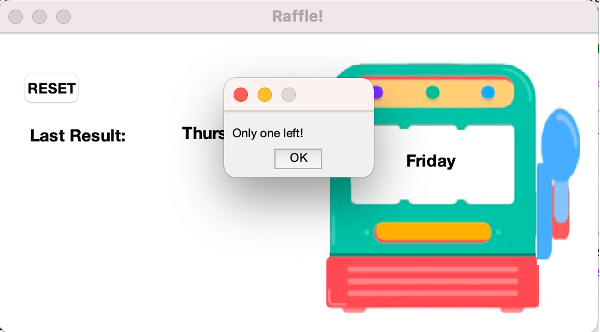

# raffle_machine
Raffle Simulation using Matlab

## Goal:
Wanna hold a raffle for the holiday party?
Or just cannot decide what to have for today's lunch?
Try using this raffle machine whenever you need to pick something randomly!

## Usage:
1. Download the entrie folder and open in Matlab.
2. Enter all inputs in the first sheet of inputs.xlsx in the folder.
3. run raffle_machine.m
4. Get all items rolling by pressing the handle
5. Press the handle again, and one item will be drawn and presented.
6. A message box will pop out if there is only one item left in the list.

7. Press RESET button to start over.

## Availble controls on the screen:
1. RESET button
2. Machine handle

## Environment:
MATLAB_R2020b
